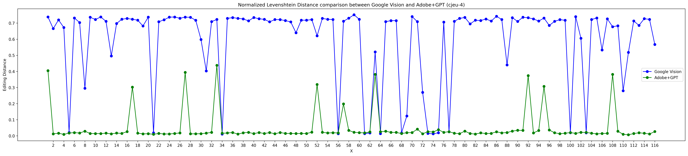

# GPT-OCR Prompt Optimize
This project's scripts are designed to optimize prompts for enhancing OCR engine outputs. The raw OCR data is stored in the `/data/` directory. Each text file within this folder corresponds to a single page with a multi-column layout, written in French. Executing `main.py` produces a comparative analysis of the normalized Levenshtein distance for both Google Vision and Adobe+GPT, presented through textual and graphical outputs. The process of crafting a more accurate prompt is currently manual, relying on a trial-and-error approach. Below is an illustrative baseline result for the `cjeu-4` engine, showcasing the prompt utilized in our sample cases.



## Setup and Running
1. Clone the repository - `git clone https://github.com/your-username/your-repository.git`
2. Install dependencies.
   `pip install -r requirements.txt`
3. Obtain your OpenAPI key and set it to your local environment variable `OPENAI_API_KEY`
4. Run

 ```python
Usage:
    python src/main.py {'cjeu-35-turbo-instruct'|'cjeu-4'} 'system-prompt-string' 'user-prompt-string' [options]

Options:
    --indices   Index of files to be run. 
    --sample    Percentage of input data to process. (1-100)%

Examples:
    python src/main.py 'cjeu-35-turbo-instruct' 'Consider the OCR output text and make corrections. The language is French.' 'Please note that the text to be corrected is in French. Fix spelling mistakes, do not add/remove words, make consistent word spacing, add missing spaces, fix font case issues within words, fix numbering issues, make consistent line breaks for the following text: Your text here' --indices 2 3 4 10 15 21
    python src/main.py 'cjeu-4' 'Consider the OCR output text and make corrections. The language is French.' 'Please note that the text to be corrected is in French. Fix spelling mistakes, do not add/remove words, make consistent word spacing, add missing spaces, fix font case issues within words, fix numbering issues, make consistent line breaks for the following text: Your text here' --sample 20
 
 ```

## Results
After running the script on input data, 
- **textual results** can be obtained from `/data/fr/GPT_<timestamp>/result.txt` and `/data/fr/GPT_<timestamp>/error_stat.txt`
- **graphical results** can be obtained from `/data/GPT_<timestamp>.png`

Note that every run will generate separate result files/folders that can be uniquely identified by a `<timestamp>`. 

The rows in `result.txt` takes the following format:
```python
<fileid> <filename> <google-vision-edit-distance> <adobe-gpt-edit-distance>
```
## Warning
The use of OpenAI's API is not free and is subject to the pricing policies set by OpenAI. Usage costs are incurred based on the number of tokens processed. Detailed pricing information can be found on the OpenAI pricing page. If you choose to run or integrate this code, any and all charges incurred for API usage will be billed to the client of this specific project. We urge you to be mindful of potential bugs or unnecessary loops in the code that might lead to excessive and unintended API calls. Such issues can result in unexpected charges to the client. It's recommended to thoroughly test the code in a controlled environment before extensive usage.
## Issue Reporting
If you encounter any bugs or issues while using the scripts, please report them in the Issues section. Include a brief description of the problem and steps to reproduce it. 